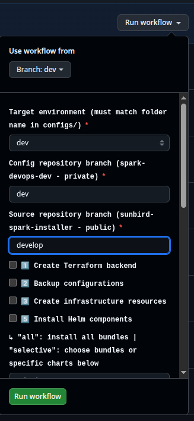

# Sunbird Spark — Private Deployment Repository Setup

This guide walks through creating a **private GitHub repository** that holds your environment configuration (encrypted) and GitHub Actions workflows to deploy Sunbird Spark using `sunbird-spark-installer` as the source.

> Throughout this guide, `demo` is used as the environment name. Replace it with your own (e.g. `production`, `staging`, `uat`).

---

## Choose Your Deployment Path

| Path | When to use |
|------|-------------|
| **GitHub Actions** | Automated CI/CD — requires encrypted config and Azure OIDC auth |
| **Manual via Azure VM** | Quick start — SSH into a VM and run `install.sh` directly, no CI/CD setup needed |

For GitHub Actions, the workflow clones `sunbird-spark-installer` at runtime — your private repo only holds the encrypted config and workflow files.

Skip to [Manual Deployment via Azure VM](#alternative-manual-deployment-via-azure-vm) if you prefer that path.

---

## Repository Structure

```
spark-devops/
├── .github/
│   └── workflows/
│       ├── sunbird-spark-platform.yaml     ← main deployment workflow
│       └── sunbird-spark-addons.yaml       ← addons workflow (optional)
└── configs/
    └── demo/                               ← your environment name
        ├── global-values.yaml              ← YOU create this (encrypted)
        ├── global-cloud-values.yaml        ← auto-generated after infra run
        ├── tf.sh                           ← auto-generated after backend creation
        └── env.json                        ← auto-generated after post-install
```

> **Do not manually create** `global-cloud-values.yaml`, `tf.sh`, or `env.json` — the workflows generate and commit them automatically.

---

## Step 1 — Create the Private Repository

1. Create a new **private** repository in your GitHub account or organization.

2. Clone it locally and create the folder structure:

```bash
git clone https://github.com/org-name/spark-devops.git
cd spark-devops
mkdir -p .github/workflows configs/demo
```

---

## Step 2 — Copy Workflow Templates

```bash
INSTALLER_PATH=/path/to/sunbird-spark-installer

cp $INSTALLER_PATH/private-repo-setup/.github/workflows/sunbird-spark-platform.yaml .github/workflows/
cp $INSTALLER_PATH/private-repo-setup/.github/workflows/sunbird-spark-addons.yaml .github/workflows/
```

---

## Step 3 — Prepare `global-values.yaml`

```bash
cp $INSTALLER_PATH/opentofu/azure/template/global-values.yaml configs/demo/global-values.yaml
```

Open the file and fill in all required fields — see the root [README.md](../README.md) for the full field reference.

> **Important:** `global.environment` must exactly match the `configs/` folder name and the GitHub Actions environment name set in Step 6.

---

## Step 4 — Encrypt and Commit the Config

```bash
pip install ansible

ansible-vault encrypt configs/demo/global-values.yaml
# Enter a strong password and save it securely — this becomes ANSIBLE_VAULT_PASSWORD in Step 6.

git add configs/demo/global-values.yaml
git commit -m "Add encrypted environment config"
git push
```

> Confirm encryption: the file should start with `$ANSIBLE_VAULT;1.1;AES256`. Never commit it unencrypted.

---

## Step 5 — Set Up Azure OIDC Authentication

The workflows authenticate to Azure using OIDC federated credentials — no client secrets stored in GitHub.

Two service principals are needed. They are set up with separate scripts so each can be run independently.

### 5a — Infra SP

Edit the variables at the top of `setup-infra-sp.sh` and run it (requires `az` CLI and Azure Owner access):

```bash
TENANT_ID=""           # Azure Portal → Azure Active Directory → Overview → Tenant ID
SUBSCRIPTION_ID=""     # Azure Portal → Subscriptions → Subscription ID
BUILDING_BLOCK=""      # Must match global.building_block in global-values.yaml
ENVIRONMENT=""         # Must match your configs/ folder name (e.g. "demo")
RESOURCE_GROUP=""      # Azure resource group (e.g. "myorg-demo")
GITHUB_REPO=""         # "org-name/spark-devops"
GITHUB_ENVIRONMENT=""  # Same as ENVIRONMENT
```

```bash
bash $INSTALLER_PATH/private-repo-setup/scripts/setup-infra-sp.sh
```

Creates `<building_block>-<env>-github-infra` — provisions AKS, storage, networking. Prints `AZURE_INFRA_CLIENT_ID`.

### 5b — Deploy SP

> **Prerequisite:** the AKS cluster must already exist before running this script. The deploy SP is assigned the `Azure Kubernetes Service Cluster Admin Role` at cluster scope — this will fail if the cluster does not exist yet.
>
> Run Phase 1 (infrastructure) first, then come back to run this script.

Edit the same variables at the top of `setup-deploy-sp.sh` and run it:

```bash
bash $INSTALLER_PATH/private-repo-setup/scripts/setup-deploy-sp.sh
```

Creates `<building_block>-<env>-github-deploy` — runs kubectl and helm. Assigned both `Azure Kubernetes Service Cluster Admin Role` and `Azure Kubernetes Service Cluster User Role` at cluster scope. Prints `AZURE_DEPLOY_CLIENT_ID`.

Both scripts are idempotent — safe to re-run if anything needs to be recreated.

---

## Step 6 — Configure GitHub Secrets

Go to **Settings → Secrets and variables → Actions → New repository secret** and add:

| Secret | Source |
|--------|--------|
| `ANSIBLE_VAULT_PASSWORD` | Password from Step 4 |
| `AZURE_INFRA_CLIENT_ID` | Printed by `setup-infra-sp.sh` (Step 5a) |
| `AZURE_DEPLOY_CLIENT_ID` | Printed by `setup-deploy-sp.sh` (Step 5b) |
| `AZURE_TENANT_ID` | Azure AD → Overview → Tenant ID |
| `AZURE_SUBSCRIPTION_ID` | Azure Portal → Subscriptions |

---

## Step 7 — Set Environment Name in Workflows

In both workflow files, replace `your-env` with your environment name:

```yaml
options:
  - demo     # your environment name
default: demo
```

```bash
git add .github/
git commit -m "Configure workflow environment name"
git push
```

---

## Step 8 — Run the Deployment

Go to **Actions → Spark Platform Infra And Deploy → Run workflow**.

Fill in the inputs before enabling any steps:



| Input | Description |
|-------|-------------|
| **Use workflow from** | Branch of your private repo the workflow itself runs from (usually `main`) |
| **environment** | Your environment name (e.g. `demo`) — must match your `configs/` folder name |
| **config_branch** | Branch of **your private repo** to read config and encrypted secrets from (default: `main`) |
| **source_branch** | Branch of **sunbird-spark-installer** (public repo) to clone at runtime (default: `main`) |

> `config_branch` and `source_branch` let you test config changes or a new installer release independently — change one without touching the other.

Run in three phases:

### Phase 1 — Infrastructure

Enable and run:
- `1️⃣ Create Terraform backend`
- `3️⃣ Create infrastructure resources`

Provisions AKS, VNet, storage, Key Vault, and managed identities. The workflow auto-commits `global-cloud-values.yaml` and `tf.sh` back to `configs/demo/`.

> **After Phase 1 completes**, go back and run `setup-deploy-sp.sh` (Step 5b) if you haven't done so yet — the AKS cluster now exists and the role assignment will succeed.

After this phase, **add a DNS A record** for your domain pointing to the load balancer public IP shown in the workflow output.

### Phase 2 — Deploy Helm Bundles

Enable `5️⃣ Install Helm components`, mode: `all`.

Deploys all 7 building blocks in order: monitoring → edbb → learnbb → knowledgebb → obsrvbb → inquirybb → additional.

> First run takes 25–40 minutes as container images are pulled.

### Phase 3 — Finalise the Platform

Run in order:

- `7️⃣ Restart workloads using keycloak keys`
- `8️⃣ Configure certificate keys`
- `9️⃣ DNS mapping`
- `🔟 Generate Postman environment file`
- `1️⃣1️⃣ Run post-install`
- `1️⃣2️⃣ Create client forms`

---

## Deploying Specific Helm Charts

Use this when you need to deploy or upgrade one or more specific services within a bundle without running the full bundle install. Typical time: 3–5 minutes.
### Via GitHub Actions

1. Enable `5️⃣ Install Helm components`
2. Set `helm_mode` to `selective`
3. Enter chart names in the `specific_charts` field (space-separated, e.g. `lern keycloak`)
4. Check **exactly one** bundle checkbox that contains those charts

### Via Manual Deployment (Azure VM)

```bash
cd opentofu/azure/<env-name>

# Single chart
./install.sh install_service <bundle> <chart>

# Multiple charts within the same bundle
./install.sh install_service <bundle> <chart1> <chart2> <chart3>
```

Examples:

```bash
./install.sh install_service learnbb lern
./install.sh install_service learnbb lern keycloak
./install.sh install_service edbb player
./install.sh install_service knowledgebb knowlg search
```

### Available Charts per Bundle

| Bundle | Targetable Charts |
|--------|-------------------|
| `edbb` | `kafka` `yugabyte` `router` `nginx-private-ingress` `nginx-public-ingress` `echo` `player` `kong` `kong-apis` `kong-consumers` `knowledgemw` `secor` |
| `learnbb` | `kafka` `elasticsearch` `yugabyte` `lern` `keycloak` `keycloak-kids-keys` `flink` `adminutil` `cert` `certificateapi` `certificatesign` `certregistry` `registry` |
| `knowledgebb` | `elasticsearch` `kafka` `yugabyte` `janusgraph` `knowlg` `search` `flink` |
| `obsrvbb` | `yugabyte` `superset` |
| `additional` | `volume-autoscaler` `nlweb` `nlwebflink` `kafka` |

> `monitoring` and `inquirybb` do not use per-chart conditions — use `install_component` to redeploy them.

### Limitations

- **One bundle per call** — charts from two different bundles cannot be targeted in a single call. Run two separate `install_service` calls if needed.
- **No job-completion wait** — `install_service` returns as soon as Helm submits the resources, without `--wait-for-jobs`. This is intentional for fast iteration; monitor Job-based charts (e.g. `keycloak-kids-keys`, migrations) manually if needed.
- **GitHub Actions: one bundle checkbox only** — checking multiple bundle checkboxes alongside `specific_charts` is not supported; only one bundle will be used.

---

## Step 9 (Optional) — Deploy Addons

Go to **Actions → Spark Platform Addons → Run workflow**.

The dispatch panel has the same three branch/environment inputs as Step 8.

| Addon | Steps |
|-------|-------|
| DIAL | Run `1️⃣ Run DIAL addon OpenTofu` first, then `2️⃣ → DIAL`. Set `deployed_dial_addon: "true"` in `global-values.yaml` before Phase 2. |
| Discussion Forum | Enable `2️⃣ → Discussion Forum` |
| Video Stream Generator | Enable `2️⃣ → Video Stream Generator` |

---

## Auto-Generated Files Reference

| File | Created by |
|------|-----------|
| `configs/demo/global-cloud-values.yaml` | `create_tf_resources` |
| `configs/demo/tf.sh` | `create_tf_backend` |
| `configs/demo/env.json` | `generate_postman_env` |
| `configs/demo/addons/global-cloud-values.yaml` | DIAL infra step |
| `configs/demo/**/.terraform.lock.hcl` | `tofu init` |

---

## Alternative: Manual Deployment via Azure VM

SSH into a dedicated Azure VM and run `install.sh` directly. No private GitHub repo or encrypted config needed.

### Step 1 — Create the Installer VM

Edit variables at the top of `setup-installer-vm.sh`:

```bash
TENANT_ID=""        # Azure Portal → Azure Active Directory → Overview → Tenant ID
SUBSCRIPTION_ID=""  # Azure Portal → Subscriptions → Subscription ID
BUILDING_BLOCK=""   # Must match global.building_block in global-values.yaml
ENVIRONMENT=""      # Environment name (e.g. "demo")
RESOURCE_GROUP=""   # Azure resource group (e.g. "myorg-demo")
LOCATION=""         # Azure region (e.g. "Central India", "East US")
```

Run it (requires `az` CLI and Azure Owner access):

```bash
bash $INSTALLER_PATH/private-repo-setup/scripts/setup-installer-vm.sh
```

Creates an Ubuntu 22.04 VM (`Standard_B2s`) with a system-assigned managed identity and least-privilege RBAC for OpenTofu. Prints the SSH command when done.

### Step 2 — SSH into the VM

```bash
ssh -i ~/.ssh/<building_block>-<env>-installer-vm azureuser@<vm-public-ip>
```

### Step 3 — Install Required CLI Tools

```bash
# Azure CLI
curl -sL https://aka.ms/InstallAzureCLIDeb | sudo bash

# OpenTofu
curl -fsSL https://get.opentofu.org/install-opentofu.sh | sudo sh -s -- --install-method standalone

# Terragrunt
sudo wget -qO /usr/local/bin/terragrunt \
  https://github.com/gruntwork-io/terragrunt/releases/download/v0.77.5/terragrunt_linux_amd64
sudo chmod +x /usr/local/bin/terragrunt

# kubectl
curl -LO "https://dl.k8s.io/release/$(curl -L -s https://dl.k8s.io/release/stable.txt)/bin/linux/amd64/kubectl"
sudo install -o root -g root -m 0755 kubectl /usr/local/bin/kubectl

# Helm
curl https://raw.githubusercontent.com/helm/helm/main/scripts/get-helm-3 | bash

# yq, jq, rclone
sudo wget -qO /usr/local/bin/yq https://github.com/mikefarah/yq/releases/latest/download/yq_linux_amd64
sudo chmod +x /usr/local/bin/yq
sudo apt-get install -y jq rclone

# Postman CLI
curl -o- "https://dl-cli.pstmn.io/install/linux64.sh" | sh
```

### Step 4 — Clone and Configure the Installer

```bash
git clone https://github.com/Sunbird-Spark/sunbird-spark-installer.git
cd sunbird-spark-installer/opentofu/azure

cp -r template demo
cd demo
# Open global-values.yaml and fill in all required fields
```

### Step 5 — Run the Installer

Full installation:

```bash
time ./install.sh
```

Or phase by phase:

```bash
./install.sh create_tf_backend
./install.sh create_tf_resources
./install.sh install_helm_components
./install.sh restart_workloads_using_keys
./install.sh certificate_config
./install.sh dns_mapping
./install.sh generate_postman_env
./install.sh run_post_install
./install.sh create_client_forms
```

---

## Troubleshooting

**`ansible-vault: command not found`**
Run `pip install ansible` or `pip3 install ansible`.

**Azure login fails — OIDC token exchange failed**
Check that the GitHub repo name in `setup-infra-sp.sh` / `setup-deploy-sp.sh` exactly matches your private repo (case-sensitive) and the GitHub environment name matches. Both scripts are idempotent — safe to re-run.

**`global-cloud-values.yaml not found` warning during deploy**
Expected on the first run before Phase 1 completes. Finish `create_tf_resources` first.

**AKS credentials step fails — cluster not found**
Ensure `global.building_block` matches what was used during infra creation. Cluster name is `{building_block}-{environment}`.

**Helm install times out**
Re-run the same bundle. `helm upgrade --install` is idempotent.

**DNS mapping times out**
Add the A record manually and re-run Phase 3 from `9️⃣ dns_mapping`.